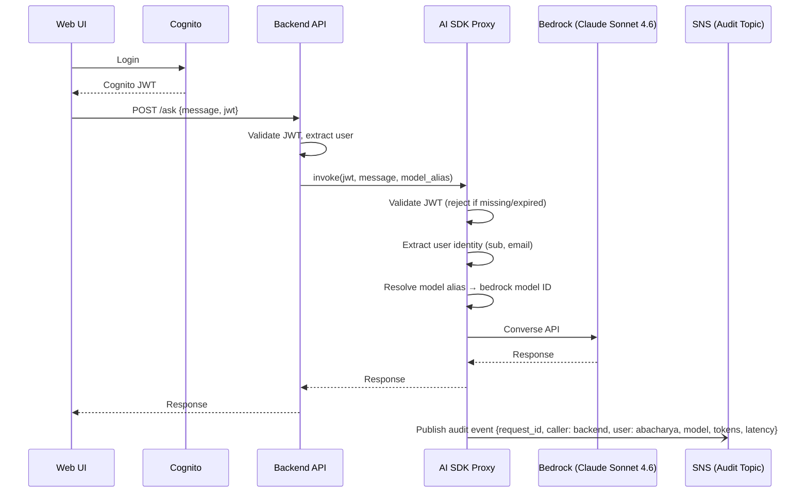
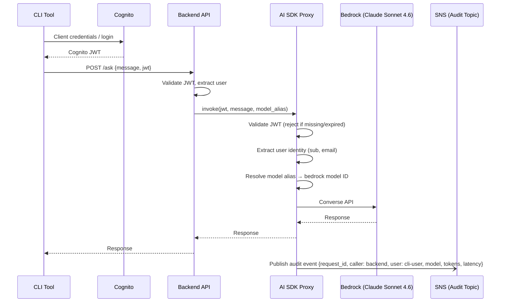
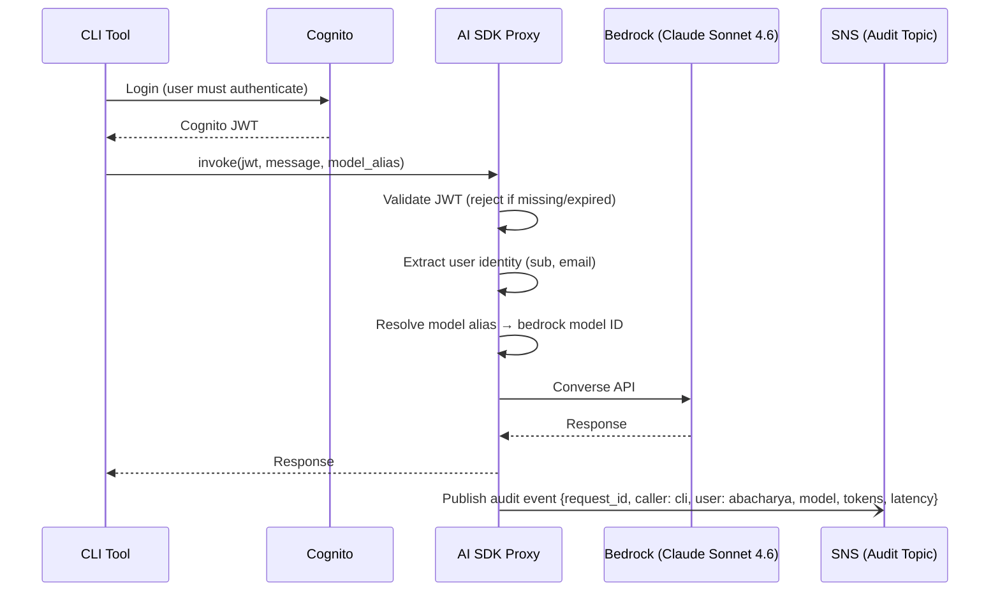
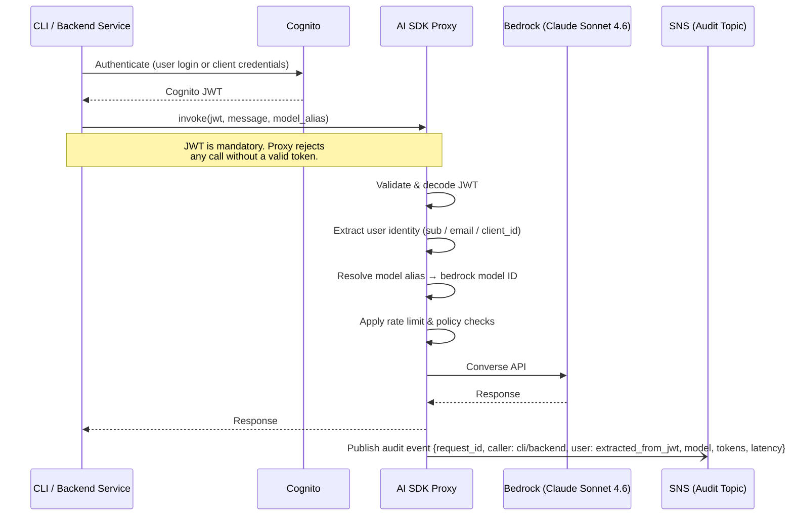
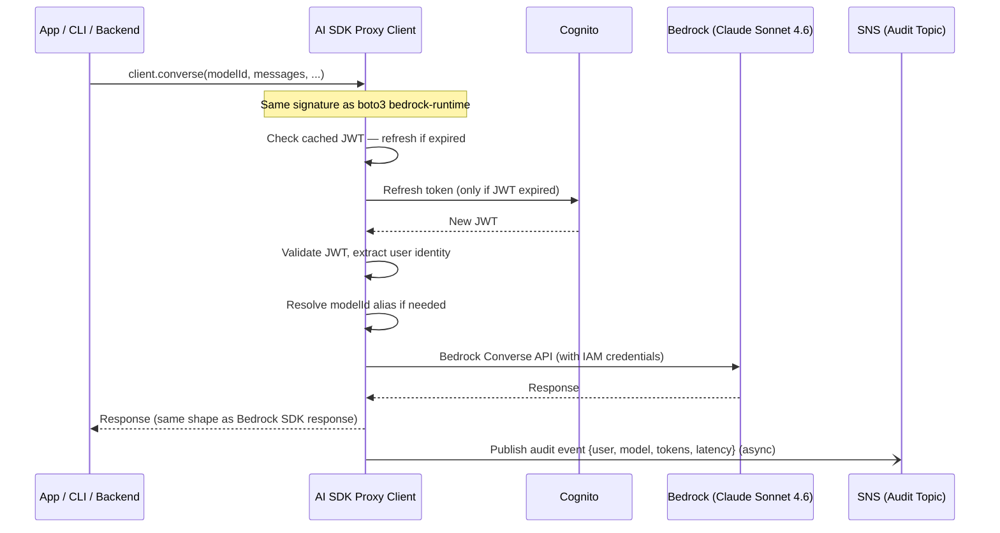

# End-to-End Flow Diagrams

## Architecture Overview

The **AI SDK Proxy** is the single mandatory gateway between every caller and Bedrock. No service, CLI, or backend talks to Bedrock directly. This gives us one centralized place to enforce:

- **Identity** — validate Cognito JWT and extract user
- **Policy** — model alias resolution, rate limits, allowed models
- **Audit** — every request published to SNS, consumed downstream by subscribers (RDS, S3, CloudWatch, etc.)

```
┌──────────┐     ┌──────────────┐     ┌───────────────────┐     ┌────────────────────────┐
│  UI /    │────▶│  Backend /   │────▶│   AI SDK Proxy    │────▶│  Bedrock               │
│  CLI     │     │  direct call │     │  (auth · policy · │     │  (Claude Sonnet 4.6)   │
└──────────┘     └──────────────┘     │   audit · route)  │     └────────────────────────┘
                                      └───────────────────┘
                                               │ (async)
                                               ▼
                                      ┌─────────────────┐
                                      │   SNS Topic      │
                                      │  (audit events)  │
                                      └────────┬────────┘
                              ┌────────────────┼────────────────┐
                              ▼                ▼                ▼
                       ┌──────────┐    ┌──────────────┐  ┌───────────┐
                       │   RDS    │    │  S3 / Glacier │  │CloudWatch │
                       │(hot log) │    │ (cold archive)│  │ (metrics) │
                       └──────────┘    └──────────────┘  └───────────┘
```

---

## Flow 1: UI → Backend → AI SDK Proxy → LLM



---

## Flow 2: CLI → Backend API → AI SDK Proxy → LLM



---

## Flow 3: CLI → AI SDK Proxy directly → LLM



> **Enforcement rule:** The proxy rejects any invocation without a valid Cognito JWT. There is no anonymous or IAM-role-only path — every call must carry user identity.

---

## Flow 4: CLI / Backend → AI SDK Proxy → LLM (Direct, no Backend layer)

This is the key flow where a CLI tool or backend service calls the **AI SDK Proxy directly**, without going through an intermediate backend API. The proxy is still the mandatory interceptor — the caller never reaches Bedrock directly.



### How user identity is captured in Flow 4

| Step | Where | What happens |
|------|--------|--------------|
| 1 | Caller | Authenticates with Cognito, receives JWT |
| 2 | Caller | Passes JWT in every proxy invocation (mandatory field) |
| 3 | AI SDK Proxy | Validates JWT signature and expiry — rejects if invalid |
| 4 | AI SDK Proxy | Extracts `sub`, `email`, `client_id` from JWT claims |
| 5 | AI SDK Proxy | Attaches identity to the request context before forwarding to Bedrock |
| 6 | AI SDK Proxy | Publishes audit event to SNS (async, after response returned to caller) |

> **Why this is safe:** Unlike a "shared wrapper" approach where each caller writes its own audit log, the proxy centralizes all of this. A caller cannot bypass audit or identity capture — they can only call the proxy, and the proxy enforces everything before touching Bedrock.

### AI SDK Proxy — Responsibilities

```
┌──────────────────────────────────────────────────────────────┐
│                        AI SDK Proxy                          │
│                                                              │
│  1. Auth gate     — validate Cognito JWT, reject if absent   │
│  2. Identity      — extract user from token claims           │
│  3. Policy        — model alias resolution, allowed models   │
│  4. Rate limiting — per-user / per-service quotas            │
│  5. Routing       — forward to correct Bedrock model/region  │
│  6. Audit         — publish event to SNS after every call    │
│  7. Error wrap    — normalize Bedrock errors for callers     │
└──────────────────────────────────────────────────────────────┘
```

---

## AI SDK Proxy — Drop-in Replacement Design

The proxy client mirrors the AWS Bedrock SDK interface exactly. App teams only change their import — no new learning curve.

### What changes for the app team

```python
# Before — direct Bedrock SDK
import boto3
client = boto3.client("bedrock-runtime", region_name="us-east-1")

# After — AI SDK Proxy (drop-in replacement)
from ai_sdk import BedrockRuntimeClient
client = BedrockRuntimeClient(jwt=get_current_user_jwt())
```

Every method call after that is **identical**.

---

### Supported APIs & Method Parity

All methods are **identical in name, parameters, and return shape** to the AWS boto3 `bedrock-runtime` client. No changes required in calling code.

| # | Bedrock SDK Method | Proxy behavior |
|---|-------------------|----------------|
| 1 | `invoke_model()` | Intercept → auth → audit → forward |
| 2 | `invoke_model_with_response_stream()` | Intercept → auth → audit → stream forward |
| 3 | `converse()` | Intercept → auth → audit → forward |
| 4 | `converse_stream()` | Intercept → auth → audit → stream forward |
| 5 | `apply_guardrail()` | Pass-through with identity context |
| 6 | `invoke_guardrail_checks()` | Pass-through with identity context |
| 7 | `count_tokens()` | Pass-through (no LLM call, still audited) |
| 8 | `start_async_invoke()` | Intercept → auth → audit → forward async job |
| 9 | `get_async_invoke()` | Pass-through to Bedrock async job status |
| 10 | `list_async_invokes()` | Pass-through, filtered to caller's own jobs |
| 11 | `can_paginate()` | Delegated directly to underlying boto3 client |
| 12 | `get_paginator()` | Delegated directly to underlying boto3 client |
| 13 | `get_waiter()` | Delegated directly to underlying boto3 client |
| 14 | `close()` | Closes proxy + underlying boto3 client |

> **Intercept** = validate JWT + extract identity + resolve model alias + write audit log.
> **Pass-through** = forward as-is to Bedrock, still attaches identity context for audit.
> **Delegated** = thin wrapper directly calling the underlying boto3 client method.

---

### How the proxy wraps each call internally



---

### Constructor — the only new concept

The only difference from raw boto3 is the constructor accepts a JWT or a token provider:

```python
# Option 1 — pass JWT directly (backend/service use case)
client = BedrockRuntimeClient(jwt="eyJ...")

# Option 2 — pass a token provider function (recommended)
# SDK calls this automatically when token needs refresh
client = BedrockRuntimeClient(token_provider=cognito_token_provider)

# Option 3 — CLI use case, reads from local session cache
client = BedrockRuntimeClient.from_local_session()
```

After construction, all calls are identical to boto3:

```python
# ── LLM invocation ────────────────────────────────────────────────

# invoke_model
response = client.invoke_model(
    modelId="anthropic.claude-sonnet-4-5",
    body=json.dumps({"prompt": "Hello", "max_tokens": 100}),
    contentType="application/json"
)

# invoke_model_with_response_stream
stream = client.invoke_model_with_response_stream(
    modelId="anthropic.claude-sonnet-4-5",
    body=json.dumps({"prompt": "Hello", "max_tokens": 100}),
    contentType="application/json"
)
for event in stream["body"]:
    print(event["chunk"]["bytes"])

# converse
response = client.converse(
    modelId="anthropic.claude-sonnet-4-5",
    messages=[{"role": "user", "content": [{"text": "Hello"}]}]
)

# converse_stream
stream = client.converse_stream(
    modelId="anthropic.claude-sonnet-4-5",
    messages=[{"role": "user", "content": [{"text": "Hello"}]}]
)

# ── Guardrails ─────────────────────────────────────────────────────

response = client.apply_guardrail(
    guardrailIdentifier="my-guardrail-id",
    guardrailVersion="1",
    source="INPUT",
    content=[{"text": {"text": "some input"}}]
)

response = client.invoke_guardrail_checks(
    guardrailIdentifier="my-guardrail-id",
    guardrailVersion="1",
    source="INPUT",
    content=[{"text": {"text": "some input"}}]
)

# ── Token counting ─────────────────────────────────────────────────

response = client.count_tokens(
    modelId="anthropic.claude-sonnet-4-5",
    messages=[{"role": "user", "content": [{"text": "Hello"}]}]
)

# ── Async invocations ──────────────────────────────────────────────

# start async job
response = client.start_async_invoke(
    modelId="anthropic.claude-sonnet-4-5",
    modelInput={"inputText": "Summarize this document..."},
    outputDataConfig={"s3OutputDataConfig": {"s3Uri": "s3://my-bucket/output/"}}
)

# check status
response = client.get_async_invoke(
    invocationArn="arn:aws:bedrock:us-east-1:123456789:async-invoke/abc123"
)

# list jobs
response = client.list_async_invokes(
    statusEquals="InProgress",
    maxResults=10
)

# ── Pagination / waiters ───────────────────────────────────────────

paginator = client.get_paginator("list_async_invokes")
waiter    = client.get_waiter("async_invoke_complete")
can_page  = client.can_paginate("list_async_invokes")

# ── Cleanup ────────────────────────────────────────────────────────

client.close()
```

---

### What happens inside the proxy on every call

```
┌─────────────────────────────────────────────────────────────────┐
│                    AI SDK Proxy — call lifecycle                 │
│                                                                 │
│  1. Token check   — use cached JWT, refresh silently if expired │
│  2. Identity      — extract user from JWT claims                │
│  3. Model resolve — map alias → real Bedrock model ID           │
│  4. Forward       — call Bedrock with same params (pass-through)│
│  5. Return        — hand back exact Bedrock response to caller  │
│  6. Audit (async) — publish event to SNS (non-blocking)        │
└─────────────────────────────────────────────────────────────────┘
```

App teams get observability, identity enforcement, and audit for free — with zero changes to their existing LLM call code.
